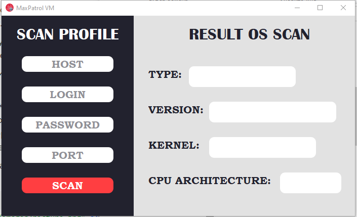
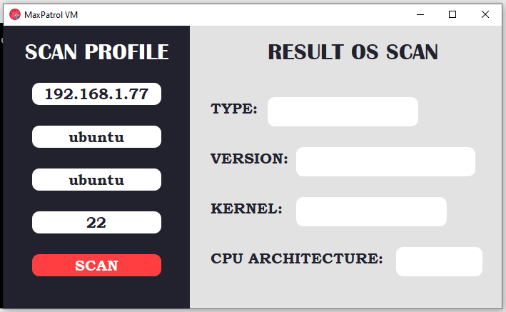
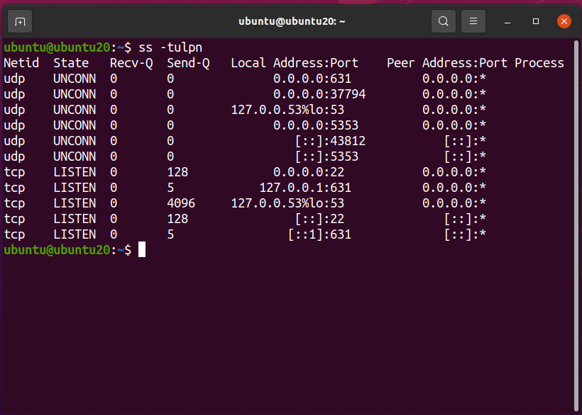
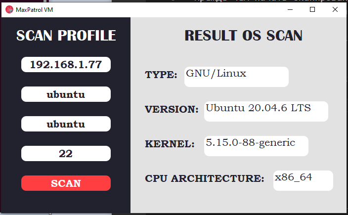
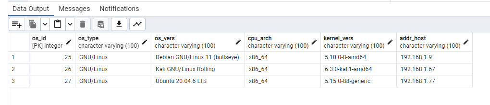

# MaxPatrol VM

Интерфейс программы выглядит следующим образом:

Прежде чем начать сканирование ОС, необходимо указать профиль сканирования (ip-адрес хоста, логин, пароль и порт для подключения по ssh)

Важно убедиться, что нужный порт открыт:

После чего сканирование будет выполнено:

А собранная информация будет помещена в базу данных:

